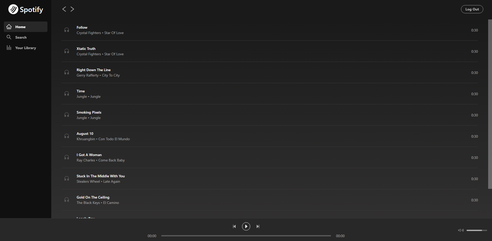

# React Spotify app

A Spotify player clone app created using **React** + **Typescript**  + **Ant Design** + **Firebase**

**Note: The app development is still in progress.

## Features

- Player play/pause/forward/backward track

## To run the app with React

1. Run `npm install`
2. Run `npm start`
3. Open the app in `http://localhost:3000`

