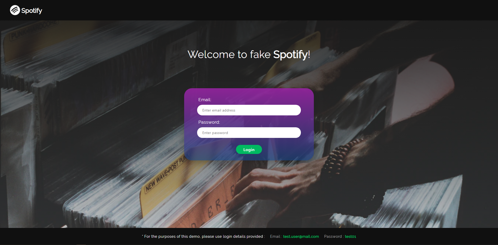
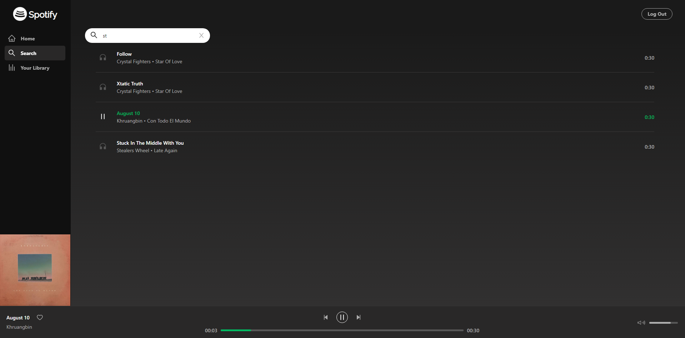

# React Spotify app

A Spotify player clone app created using **React** + **Typescript** + **Firebase**

**`Note:` The app development is still in progress. Try the demo** https://react-spotify-app.netlify.com/

## Features

- Login / User authentication
- Player play/pause/forward/backward track
- Progress bar / in-set progress update mode
- Active track album artwork pop-up
- Search track by Song, Artist or Album name
- Listen to 30s demo track audio live
- Add and remove tracks to the list of favourites

## To run the app with React

1. Run `npm install`
2. Run `npm start`
3. Open the app in `http://localhost:3000`

